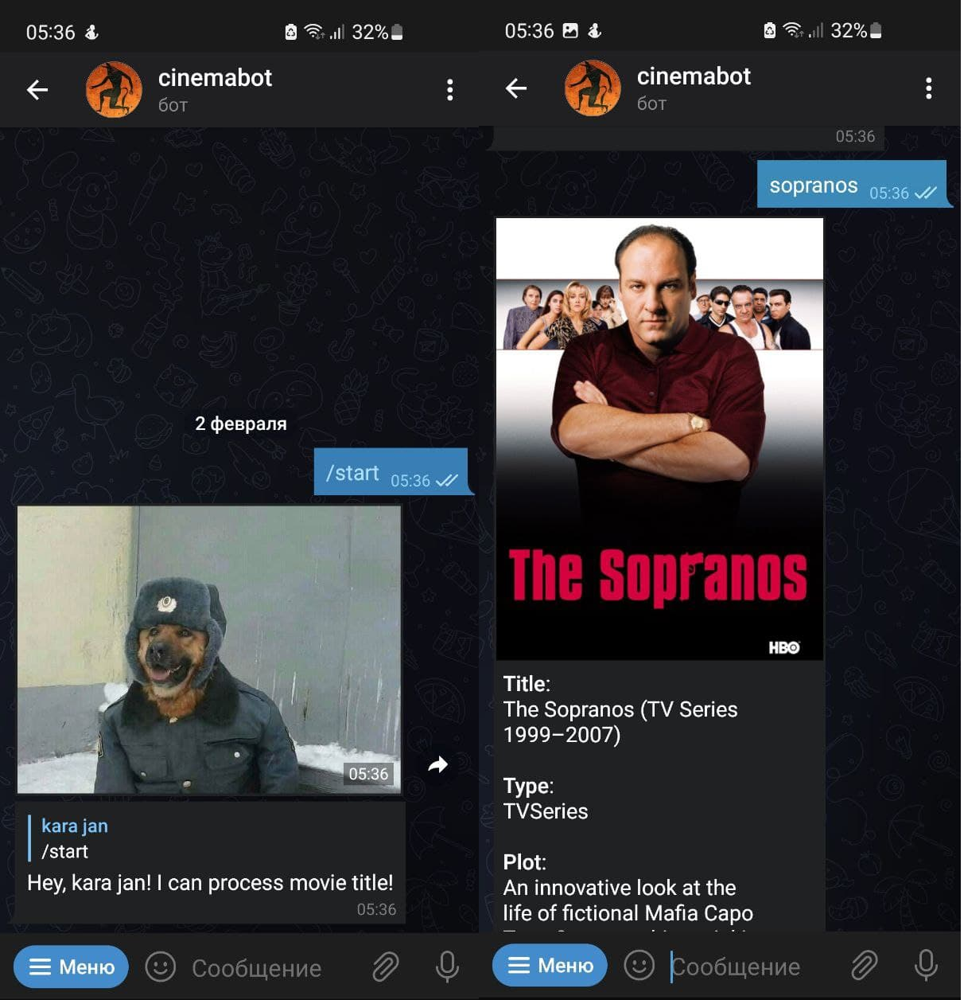

#  Cinemabot - Genius Telegram Bot @cinemaastrbot

Telegram bot for getting information about movie!

/start - to start bot 

/help - to call helper

## How to use
Enter name of the tv-show and then you'll get poster, title and description of the requested movie!

## Implementation

The bot is implemented on `aiogram` library. `aiohttp` is used for network processes. 
I used IMDb API to process expression. Thanks developers! (https://imdb-api.com/)
